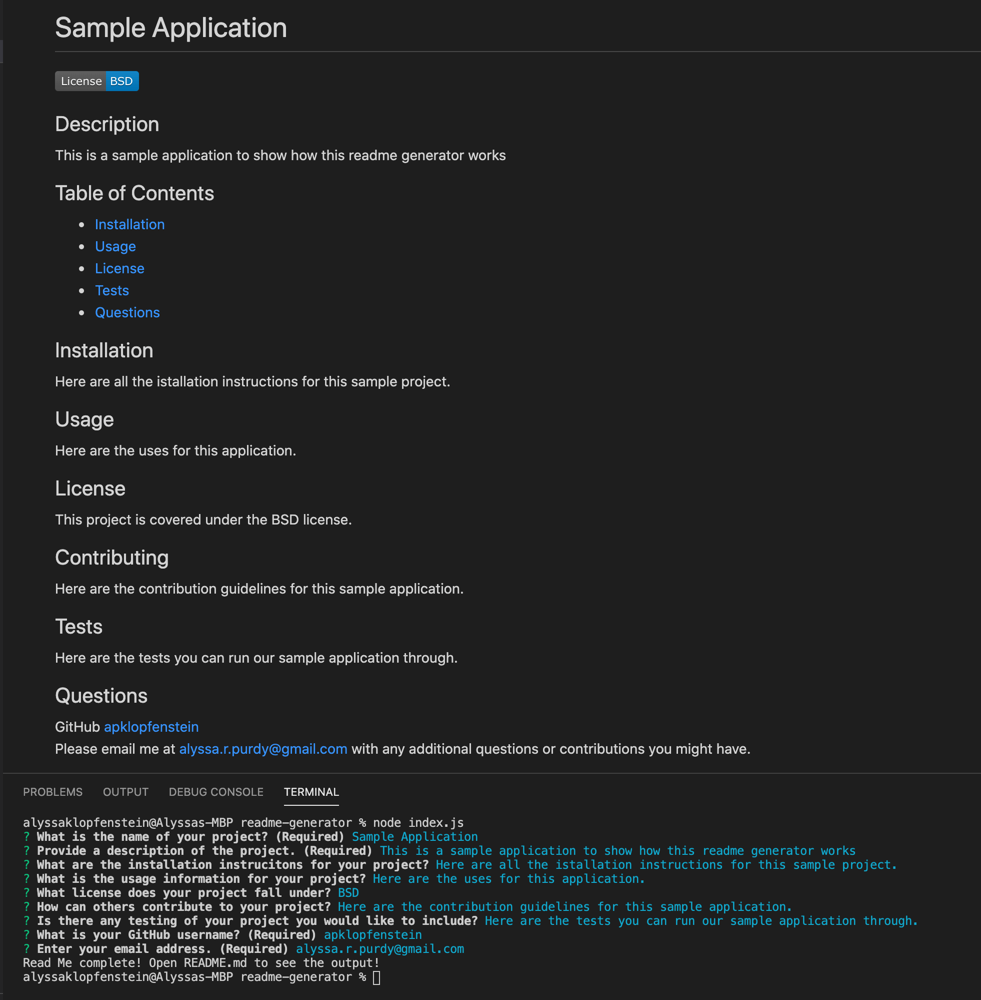

# Read Me Generator

## Purpose
The purpose of this readme generator is to help developers create professional readmes quickly and effeciently.

## Screenshot and Walkthrough Video

[Walkthrough Video](https://drive.google.com/file/d/1A7F4VkbJ3Dr9WFEe5kMD2DlDSFZJThLY/view)

## Links
[GitHub Repo](github.com/apklopfenstein/readme-generator)
